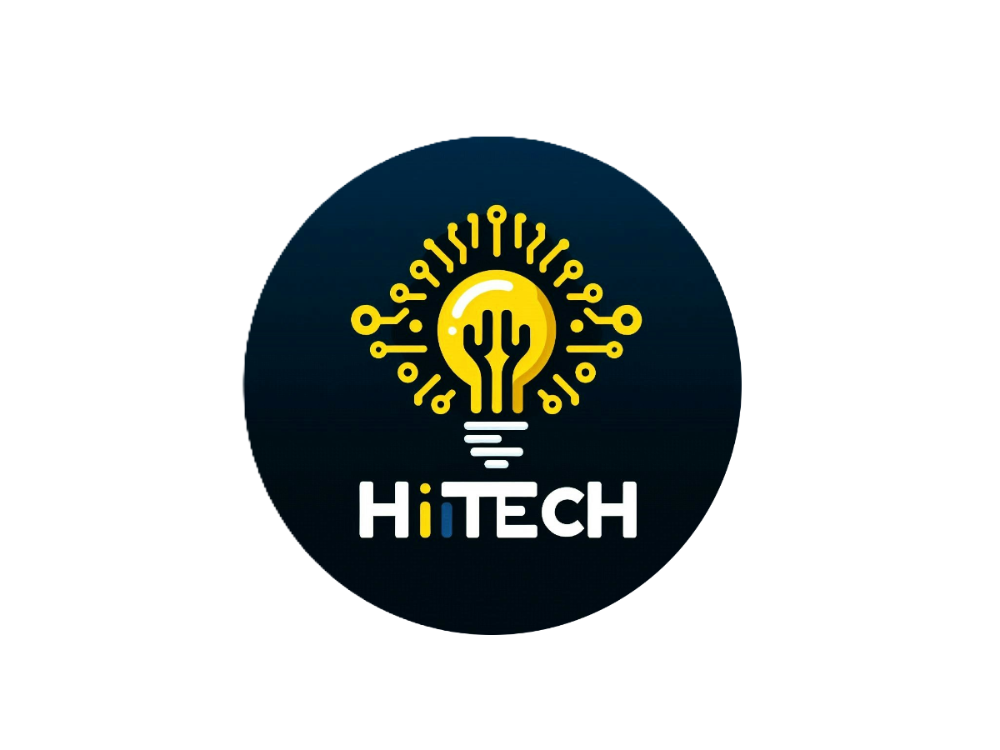

   
   <h2>
   <a href= "https://www.youtube.com/channel/UCBc3aSf54eyrl46RUWqIOIg?sub_confirmation=1"> Start Python With HiTech </a></h2>

# 🧑🏻‍💻 About Me:
Hello my name's Mohammad Rahimy and I'm python programmer. I share my own python projects on this page and want you to analyze them and help me to make them better.🚀 I also teach python language on my YouTube channel, called HiTech  and invite you to visit my channel if you're interested in programming and  share it's link in my GitHub profile.🧑🏻‍💻 It's my pleasure to attend in your project so if you work on a python  project I'll be happy to cooperate in your project.😉🧑🏻‍💻 Thanks for your attention.💖🙏🏻 

## 🌐 Socials:
    

# 🧑🏻‍💻 Tech Stack:
       
# 📊 GitHub Stats:
 
 

### 🔝 Top Contributed Repo

---

<!-- Proudly created with GPRM ( https://gprm.itsvg.in ) -->
<!-- Proudly created with GPRM ( https://gprm.itsvg.in ) -->
<!-- Proudly created with GPRM ( https://gprm.itsvg.in ) -->
<!---
AMPoet/AMPoet is a ✨ special ✨ repository because its `README.md` (this file) appears on your GitHub profile.
You can click the Preview link to take a look at your changes.
--->
